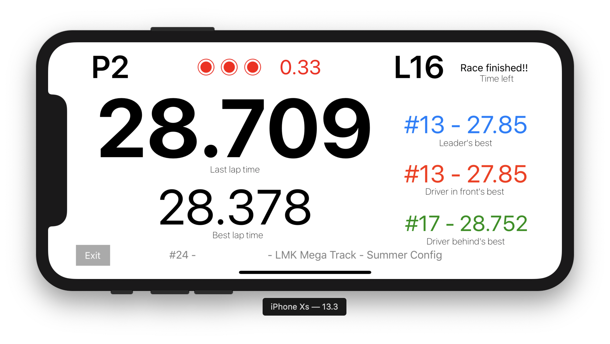

# Purple Laps

Purple Laps is an iOS app that can display your lap times (and some related info)
when you race karts at LeMans Karting in Fremont, CA.

The app uses the facility's live scores web page to get the data. Thus it's not
a lap timer in a classic sense (like AiM MyChron). In particular, the your lap time
is only updated when you pass the start-finish line.

# Release of Liability

By downloading the source code, or compiling it, or using the built app or any
derivative versions, you accept all related risks. Using the app while driving
is a horrible idea, and you may crash, get injured or injure someone. Taking
the phone with you to the track may lead to that phone being lost, or damaged,
or even damaging something or someone else around. I warned you.

# How To Use

Before the session starts:

1. Select your kart number.
1. Select the current track configuration (it's very likely either "Indoor CW" or "Mega").
1. Tap "Go!". Once the session starts, and your kart number appears on the leaderboard,
you should be able to see the data such as last lap time, best lap time, lap time delta,
position, and other driver's lap times.

It's usually a good idea test the app prior to the session by selecting someone else's
kart number from the visible leaderboard, and peaking at that kart's lap times.

# Screenshots

